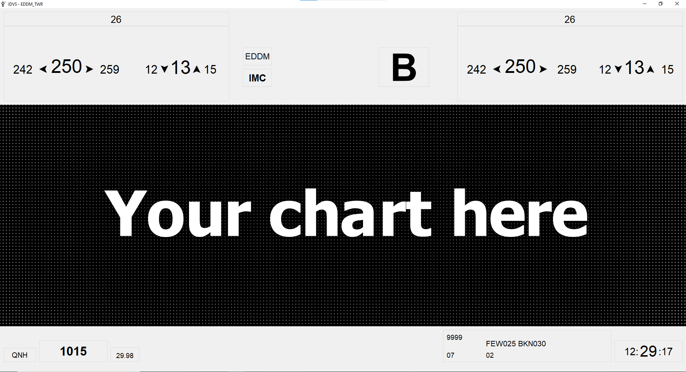

# IVAO IDVS
Push your controlling on IVAO to the next level!

## What is IDVS?
IDVS (abbreviation of "Informationsdatenverarbeitungsprogramm", which is german for: Information processing program) is a program used by the "Deutsche Flugsicherung" (DFS). Being informed about winds (especially their directions and their speed) is crucial in order to allow for a smooth and efficient use of departure and arrival slots. Thus IDVS provides this data as well as knowledge about the current meteorological and visual conditions returning whether or no these circumstances fulfill the requirement for VMC and therefore allow for VFR-flights.
Fetching data from your ATIS following data is issued:

## What do I need to do to use IDVS for my controller sessions?
1. Download a zip-file of IDVS (found at the release tab). Unpack it where you want IDVS to be.
2. Fetch yourself an API key from [AVWX here](https://account.avwx.rest/tokens) and enter it in the config.ini file. No worries, this is at no costs and there are no fees to pay while using IDVS. You have 4k free API requests a day. Requesting once a minute uses 1/3 of this available amount if you were to run IDVS 24 hours daily.
3. You may think about getting some charts to display in the chart box (Keep in mind that size should be 1920*620).

## How do I start IDVS?
1. Double click the .exe file.
2. Enter the IVAO callsign you are currently logged in as.
3. If your callsign was correct, you are online and your station features a METAR in its ATIS, you are asked to choose a chart to be displayed in the chart box (File type should be image (.png, .jpg, .jpeg) and size should be 1920*620, elsewise the image is stretched).
4. IDVS opens its main window and you are good to go! Have fun!

## How does IDVS work?
IDVS fetches your ATIS from the IVAO WhazzUp data, which is free for everyone. This happens once a minute.
- The ARR and DEP runways are fetched to get the direction of operation which will be displayed above the winds. 
- The current ATIS letter is split out of your ATIS and displayed.
- Your current METAR is fetched and sent to AVWX. They provide an API to decode it and return the data as JSON. With their response the following actions are performed:
    - The wind's direction and speed is fetched. If there are gusts, they will be displayed as well. Whenever a value is given that states how the wind varies (e.g. 220V260), this value is used. Elsewise a random value is used for to display a maximum and minimum wind speed and direction (speed's values differ by a maximum of 5 knots, wind directions differ by a maximum value of 10 degrees).
    - The QNH is fetched and will be displayed. Additionally, QNH is converted to inch, which will be shown as well.
    - Visibility and clouds are fetched and shown. There is displayed whether or no VFR is possible, using this data.
    - Temperature and dew point are fetched and shown.

Next to this the current time is updated every 250 milliseconds.

If your METAR or ATIS letter did change, these changes will be shown in a red or green color (depending on their importance). Additionally a sound will be played to notify you about the changes.
